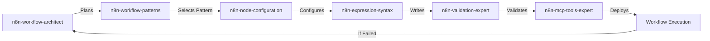

# Integration Guide

How n8n-workflow-architect integrates with other n8n skills and MCP servers for a complete workflow development experience.

## Skill Integration Flow



## MCP Server Dependencies

### 1. SequentialThinking MCP
**Purpose**: Structured critical thinking and analysis

**Integration Points**:
```javascript
// Skill activates sequentialthinking for complex analysis
mcp__sequentialthinking__sequentialthinking({
  thought: "Analyzing workflow requirements for data sync...",
  nextThoughtNeeded: true,
  thoughtNumber: 1,
  totalThoughts: 12
})
```

**When Used**:
- Requirements analysis (thoughts 1-3)
- Edge case identification (thoughts 4-6)
- Solution design (thoughts 7-9)
- Validation and verification (thoughts 10-12)

### 2. Context7 MCP
**Purpose**: Fetch latest n8n documentation

**Integration Points**:
```javascript
// Always fetch docs before planning
mcp__context7__resolve-library-id({ libraryName: "n8n" })
mcp__context7__get-library-docs({
  context7CompatibleLibraryID: "/n8n/docs",
  topic: "workflow-nodes"
})
```

**When Used**:
- Start of every planning session
- When discovering new node capabilities
- For authentication patterns
- For expression syntax reference

### 3. n8n-mcp Server
**Purpose**: Direct n8n instance interaction

**Integration Points**:
```javascript
// After planning, validate and deploy
mcp__n8n-mcp__validate_workflow({ workflow: plannedWorkflow })
mcp__n8n-mcp__n8n_create_workflow({ ...workflowConfig })
```

**When Used**:
- After architect completes planning
- For workflow validation
- For deployment and testing

## Skill Handoff Patterns

### 1. Architect → Workflow Patterns

**Trigger**: After requirements are analyzed and approach decided

**Handoff Data**:
```markdown
Requirements Summary:
- Business Goal: [defined goal]
- Systems: [list of integrations]
- Pattern Type: [webhook/scheduled/event/api/database]
- Volume: [expected throughput]
- Complexity: [simple/medium/complex]
```

**Example**:
```
Architect: "Based on analysis, this is a webhook processing pattern
          with data transformation. Handing off to workflow-patterns..."

workflow-patterns: "Using Webhook Processing Pattern #2:
                   Webhook → Validate → Transform → Store → Respond"
```

### 2. Architect → Node Configuration

**Trigger**: After node sequence is determined

**Handoff Data**:
```markdown
Node Configuration Requirements:
- Node: [node type]
- Purpose: [what it does]
- Inputs: [expected data]
- Outputs: [produced data]
- Critical Settings: [must-configure]
```

**Example**:
```
Architect: "Need Slack node configured for error notifications.
           Requirements: workspace auth, channel #alerts,
           message with error details. Handing off..."

node-configuration: "Configuring nodes-base.slack:
                    - Resource: message
                    - Operation: post
                    - Authentication: OAuth2
                    - Channel: via ID (more reliable)"
```

### 3. Architect → Expression Syntax

**Trigger**: When data transformations are needed

**Handoff Data**:
```markdown
Expression Requirements:
- Source Data: [structure]
- Target Format: [desired output]
- Transformations: [list of operations]
- Error Handling: [null/undefined approach]
```

**Example**:
```
Architect: "Need expression to extract customer email from nested JSON.
           Source: $json.order.customer.contact.email
           With null safety. Handing off..."

expression-syntax: "Expression with null safety:
                   {{ $json?.order?.customer?.contact?.email || 'no-email@provided.com' }}"
```

### 4. Architect → Validation Expert

**Trigger**: After workflow is built, before deployment

**Handoff Data**:
```markdown
Validation Checklist:
- [ ] All nodes configured
- [ ] Expressions syntax valid
- [ ] Error paths handled
- [ ] Authentication set
- [ ] Test data prepared
```

**Example**:
```
Architect: "Workflow built per plan. Please validate:
           - Webhook path uniqueness
           - Expression references
           - Node connections
           Handing off for validation..."

validation-expert: "Running validation...
                   Found issues:
                   - Webhook path conflicts with existing
                   - Expression missing null check on line 3"
```

### 5. Architect → Code Skills (JavaScript/Python)

**Trigger**: When custom logic is needed

**Handoff Data**:
```markdown
Code Requirements:
- Purpose: [what the code should do]
- Input Structure: [data format]
- Output Structure: [expected result]
- Libraries Needed: [if any]
- Error Cases: [to handle]
```

**Example**:
```
Architect: "Need JavaScript code node to parse CSV with custom delimiter.
           Input: string with | delimiter
           Output: array of objects
           Handing off to code-javascript..."

code-javascript: "Here's the code for n8n Code node:
                 const rows = $input.item.csv.split('\n');
                 return rows.map(row => {...});"
```

## Collaborative Patterns

### Pattern 1: Full Lifecycle Collaboration

```
User: "I need to sync data between systems"
    ↓
[n8n-workflow-architect]
- Fetches docs via Context7
- Analyzes with SequentialThinking
- Plans architecture
    ↓
[n8n-workflow-patterns]
- Selects appropriate pattern
    ↓
[n8n-node-configuration]
- Configures each node
    ↓
[n8n-expression-syntax]
- Writes data transformations
    ↓
[n8n-validation-expert]
- Validates configuration
    ↓
[n8n-mcp-tools-expert]
- Deploys and tests
    ↓
Success or Retry
```

### Pattern 2: Iterative Refinement

```
[n8n-workflow-architect] Plans initial approach
    ↓
[n8n-validation-expert] Finds issues
    ↓
[n8n-workflow-architect] Revises plan
    ↓
[n8n-node-configuration] Updates config
    ↓
[n8n-validation-expert] Validates again
    ↓
Success
```

### Pattern 3: Complex Logic Development

```
[n8n-workflow-architect] Identifies custom logic need
    ↓
[n8n-code-javascript] Writes initial code
    ↓
[n8n-workflow-architect] Reviews and requests changes
    ↓
[n8n-code-javascript] Refines code
    ↓
[n8n-validation-expert] Tests code node
    ↓
Integration complete
```

## Communication Protocol

### Skill Activation Sequence

1. **User Query** → Parsed for n8n context
2. **Architect Activation** → If planning/discussion detected
3. **Context Fetch** → Latest docs via Context7
4. **Analysis** → SequentialThinking activation
5. **Discussion** → Iterative refinement with user
6. **Handoff** → To appropriate next skill
7. **Callback** → If issues found during build

### Data Passing Format

Skills pass data using structured markdown:

```markdown
## Handoff from n8n-workflow-architect
**Target Skill**: n8n-node-configuration
**Context**: Email automation workflow
**Phase**: Node configuration needed

### Requirements
- Node: Gmail
- Operation: Send email
- Authentication: OAuth2
- Fields: to, subject, body (HTML)

### Constraints
- Rate limit: 250/day
- Attachment size: 25MB max

### Previous Decisions
- Chose Gmail over SMTP for better reliability
- HTML format for rich content
```

## Best Practices

### 1. Always Start with Architect
- Even for "simple" workflows
- Prevents costly rework
- Identifies hidden complexity

### 2. Respect Skill Boundaries
- Architect: Plans and thinks
- Patterns: Provides templates
- Configuration: Sets up nodes
- Validation: Checks correctness
- MCP Tools: Executes operations

### 3. Iterative Improvement
- First pass: Get it working
- Second pass: Handle edge cases
- Third pass: Optimize performance

### 4. Documentation Handoff
- Always include context
- Document decisions made
- Explain constraints
- List assumptions

### 5. Error Escalation
- If a skill fails, return to architect
- Architect reassesses approach
- May need different pattern/nodes

## Troubleshooting Integration Issues

### Issue: Skills Not Activating in Sequence

**Solution**:
```markdown
Ensure clear handoff language:
- "Handing off to [skill-name] for..."
- "Now needs [skill-name] to..."
- "Please activate [skill-name]..."
```

### Issue: Lost Context Between Skills

**Solution**:
```markdown
Include context summary in handoffs:
- Original requirements
- Decisions made so far
- Current workflow state
- Next steps needed
```

### Issue: Conflicting Recommendations

**Solution**:
```markdown
Architect has precedence for:
- Overall architecture
- Node selection
- Flow design

Other skills have precedence for:
- Specific configurations
- Syntax details
- Technical implementation
```

### Issue: Circular Dependencies

**Solution**:
```markdown
Break cycles with explicit phase markers:
- Phase 1: Planning (architect)
- Phase 2: Building (other skills)
- Phase 3: Validation (validation expert)
- Phase 4: Deployment (mcp tools)
```

## Advanced Integration Scenarios

### Scenario 1: Multi-Workflow Orchestration

```
Architect plans parent + child workflows
→ Patterns provides orchestration pattern
→ Configuration sets up Execute Workflow nodes
→ Validation checks workflow references
→ MCP Tools deploys all workflows
```

### Scenario 2: Migration from Another Platform

```
Architect analyzes existing automation
→ Patterns maps to n8n equivalent
→ Configuration translates settings
→ Code skills recreate custom logic
→ Validation ensures feature parity
```

### Scenario 3: Performance Optimization

```
Architect identifies bottlenecks
→ Patterns suggests batch processing
→ Configuration adds Split in Batches
→ Code skills optimize transformations
→ Validation confirms improvements
```

## Conclusion

The n8n-workflow-architect skill serves as the critical thinking layer that enables all other n8n skills to work more effectively. By planning thoroughly before building, the entire skill ecosystem operates more efficiently, producing higher-quality workflows with fewer iterations.